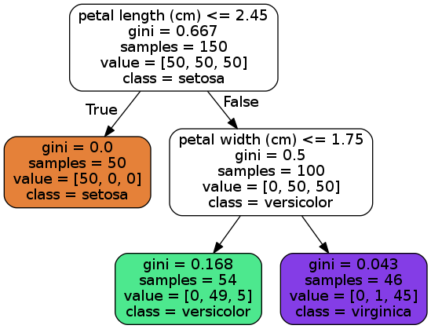
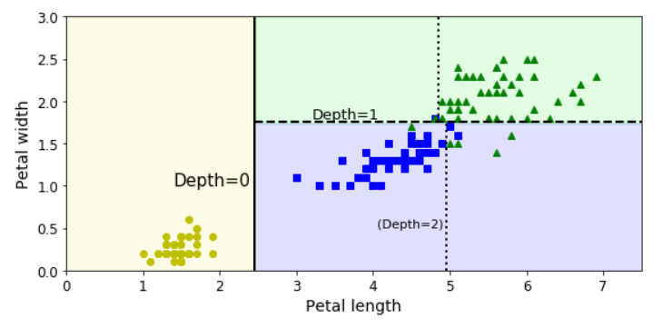
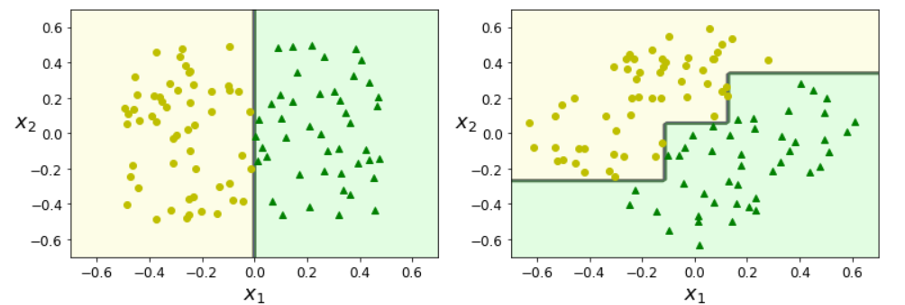
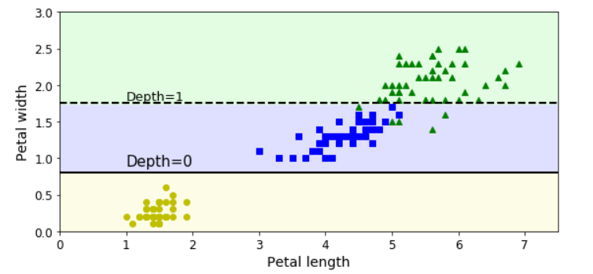

**Fun Fact:** The name **Jupyter** is an indirect acronyum of the three core languages it was designed for: **JU**lia, **PY**Thon, and **R** and is inspired by the planet Jupiter

#                                            Decision Trees

<p style = "font-family:georgia,garamond,serif;font-size:17px;font-style:italic;">
         Decision Trees are versatile Machine Learning algorithms that can perform both classification and Regression tasks.They are powerful algorithms, capable of fitting complex datasets.Decision trees are also the fundamental components of Random Forests,Which are most powerful algorithms available today. we will start our blog by discussing how to train,visualize and visualize Decision trees. 
      </p>


## Training and Visualizing a Decision Tree


```python
from sklearn.datasets import load_iris
from sklearn.tree import DecisionTreeClassifier
```


```python
iris = load_iris()
x = iris.data[:,2:] #petal length and width
y = iris.target
```


```python
tree_clf = DecisionTreeClassifier(max_depth=2)
tree_clf.fit(x,y)
```


    DecisionTreeClassifier(class_weight=None, criterion='gini', max_depth=2,
                max_features=None, max_leaf_nodes=None,
                min_impurity_decrease=0.0, min_impurity_split=None,
                min_samples_leaf=1, min_samples_split=2,
                min_weight_fraction_leaf=0.0, presort=False, random_state=None,
                splitter='best')


You can visualize the trained Decision Tree by first using the export_graphviz() method to output a graph definition file called iris_tree.dot


```python
from sklearn.tree import export_graphviz

export_graphviz(
        tree_clf,
        out_file = "iris_tree.dot",
        feature_names = iris.feature_names[2:],
        class_names = iris.target_names,
        rounded = True,
        filled = True
    )
```

we can convert the dot file into variety of formats such as PDF or PNG using the following dot command line tool from graphviz package

!dot -Tpng iris_tree.dot -o iris_tree.png

**PS**:if you are having issues using the above command there are free online services where you can upload your dot file and convert it to an image.



## Making Predictions

#### The Iris Dataset: 

This data sets consists of 3 different types of irises’ (Setosa, Versicolour, and Virginica).The rows being the samples and the columns being: Sepal Length, Sepal Width, Petal Length and Petal Width.
                        

Let's Understand how the tree shown in the above figure makes prediction about classifying the type of iris. You start from the root and ask yourself question about whether the pertal lenght is less than or equal to 5.45. If it is, then you move down to the root's left child and repeat this process till it reaches the leaf node and whatever is the class of that leaf node that is the prediced class of the decision tree.

**Cool Feauture: Decision Tree requires no feature scaling which means less data preparation.**

If we look at each node of the tree there are some attributes present.The value attribute represents how many samples of each class for example: At root node out of 150 samples [50,50,50] samples are Setosa,Versicolor and Virginica.The class at each node represent the majority of the class samples for examples if we have [150,0,0] then the class is Setosa and finally gini attribute represents the purity of the node. A node is pure(gini = 0) if all training instances it applies to belong to the same class for example : a node with value [100,0,0] and samples = 100 is a pure node.

### Gini index:

Calculation of gini index: Let's calculate gini for the extreme left leaf node.

gini = 1 - (1/7)^2 - (5/7)^2 - (1/7)^2 = 0.449 #The formula for calculating gini is shown below.

G(i) = 1 - Sum(Probabilities of each class^2)

Sci-kit learn uses CART algorithm which produces only binary trees. However,other algorithms such as ID3 can produce Decision trees with nodes more than two.

### Decision boundary



The above figure shows decision trees decision boundaries. The thick vertical line represents the decision boundary of the root node(depth 0): petal length = 2.45 cm since the left area is pure (gini = 0) it cannot be split into any furthur. However the right area is impure so we need put our next decision boundary in this area i.e petal width = 1.75 cm diving the right area into two regions. Since the max_depth is set to 2 the tree stops after making this boundary. Incase if you set the max_depth = 3 then it would add another decision boundary represented by the dotted line.

### Estimating Class Probabilities

Decision trees can estimate the proabilty that an instance belongs to a particular class K : It traverse the tree to the leaf node and returns the ratio of the training instances of class k in this node. For example, suppose you have found a flower whose petals are 5cm long and 1.5cm wide. The corresponding leaf node is at depth-2 left node. So the decision tree should output the following probabilities 0% for Iris-setosa(0/54), 90.7% for Iris-Versicolor(49/54) and 9.3% for Iris-Verginica(5/54). And of course if you ask it to predict the class,it should output Iris-Versicolor(class 1) since it has the highest probability.


```python
tree_clf.predict_proba([[5,1.5]])
```


    array([[0.        , 0.90740741, 0.09259259]])


```python
tree_clf.predict([[5,1.5]])
```


    array([1])


### CART Training Algorithm

The classification and Regression Tree training algorithm is used for training the decision trees. The algorithm first splits the dataset into two regions using a single feature k and a threshold t (e.g "petal length" <= 2.45). How does it choose k and t ?

* It searches for the pair (k,t) that produces the purest subsets(weighted by their size).The cost function that the algorithms tries to minimize is given by the equation below.


Once it has successfully split the training set in two, it splits the subsets using the same logic, recursively till it reaches max_depth(which is a hyperparameter that can be set) or until it cannot find a split that will reduce impurity.

### Regularization Hyperparameters of Decision Trees

Compared to Linear Models which assume the data to be linear, Decision trees do make make such assumptions. If left unconstrained the tree structure will adapt itself to the data and most likely overfitting it. Such a model is called non parametric model since the number of parameters is not defined prior to training unline parametric models such as linear models where the number of parameters are predetermined(reducing the risk of overfitting and increasing the risk og underfitting).

To avoid decision trees to overfit the data we can use the **max_depth** parameter to restrict the depth of the tree there are other hypterparameters like **min_samples_split** (the minimum number of samples a node must have before it can be split), **min_samples_leaf** (the minimum number of samples a leaf node must have),**min_weight_fraction_leaf** (same as min_samples_leaf but expressed as a fraction of the total number of weighted instances), **max_leaf_nodes** (maximum number of leaf nodes), and **max_features**
(maximum number of features that are evaluated for splitting at each node). 
**Increasing min_*hyperparameters or reducing max_* hyperparameters will regularize the model.**


### Instability

Hopefully by now you are convinced that Decision Trees have a lot going for them: they are simple to
understand and interpret, easy to use, versatile, and powerful. However they do have a few limitations.First, as you may have noticed, Decision Trees love **orthogonal decision boundaries** (all splits are perpendicular to an axis), which makes them sensitive to **training set rotation.** For example, Below figure shows a simple linearly separable dataset: on the left, a Decision Tree can split it easily, while on the right, after the dataset is rotated by 45°, the decision boundary looks unnecessarily convoluted. Although both Decision Trees fit the training set perfectly, it is very likely that the model on the right will not generalize well. One way to limit this problem is to use **PCA**, which often results in a better orientation of the training data.



The main issue with Decision Trees is that they are very sensitive to small variations in
the training data. For example, if you just remove the widest Iris-Versicolor from the iris training set (the one with petals 4.8 cm long and 1.8 cm wide) and train a new Decision Tree, you may get the model represented in figure below. As you can see, it looks very different from the previous Decision boundary Actually, since the training algorithm used by Scikit-Learn is stochastic you may get very
different models even on the same training data (unless you set the random_state hyperparameter).




**Random forests can limit this instabilty problem by averaging predcitions many trees.**


```python

```
